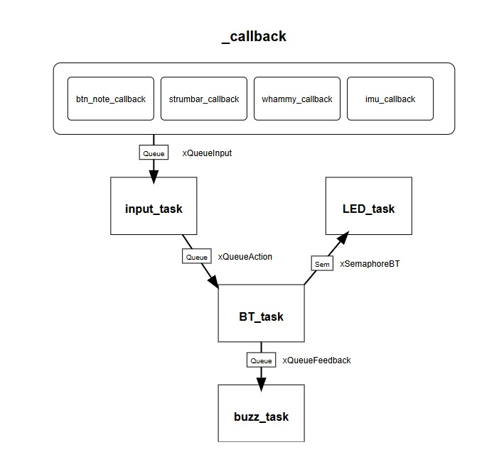
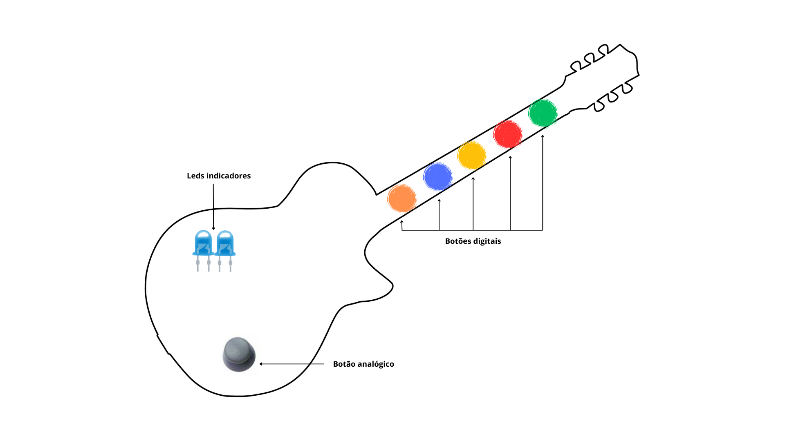

# Controle Customizado para Clone Hero

## Jogo

**Clone Hero** - Um jogo de ritmo inspirado em *Guitar Hero*, onde jogadores acertam notas que correspondem a uma trilha musical exibida na tela. O objetivo é tocar as notas corretamente no tempo certo para maximizar a pontuação e a performance.

## Ideia do Controle

O controle será especialmente desenvolvido para o *Clone Hero*, simulando uma guitarra de rock com botões para as notas e um strum bar para simular as palhetadas. A ideia é proporcionar uma experiência mais autêntica e envolvente, utilizando entradas analógicas e digitais para um controle preciso das notas e efeitos durante o jogo.

## Inputs e Outputs

### **Entradas (Inputs)**

- **Barra de Palhetada (Strum Bar) analógica:** Para simular a palhetada, permitindo uma resposta mais natural.
- **5x Entradas Digitais:**
  - Botões de notas (verde, vermelho, amarelo, azul, laranja)
  - Botão de Star Power
- **Whammy Bar analógico:** Para alterar o pitch das notas em longas sustentações.
- **IMU (Unidade de Medição Inercial):** Para detectar o movimento da guitarra, utilizável em manobras específicas como ativar o Star Power.

### **Saídas (Outputs)**

- **LEDs indicadores de conexão e status do jogo:** Para feedback visual da conexão com o PC e status do Star Power.
- **Motor de vibração:** Para feedback tátil baseado nas ações do jogo, como perder notas ou acionar o Star Power.

## Protocolo Utilizado

- **Bluetooth:** Para uma comunicação sem fio eficiente entre o controle e o PC.
- **GPIO Interrupts:** Para entradas digitais com resposta imediata.

## Diagrama de Blocos Explicativo do Firmware

### **Estrutura Geral**

---

---

#### **Principais Componentes do RTOS**

- **Tasks:**

  - Task de leitura das entradas analógicas e digitais
  - Task de envio de comandos via Bluetooth
  - Task de controle do motor de vibração para feedback tátil
  - Task de atualização dos LEDs indicadores
- **Filas:**

  - Fila de eventos de entrada
  - Fila de comandos para o jogo
  - Fila de eventos para feedback
- **Semáforos:**

  - Semáforo para gerenciamento do estado da conexão Bluetooth
- **Interrupts:**

  - Callbacks para os botões e barras analógicas

## Imagens do Controle

### **Proposta Inicial**

---

---
